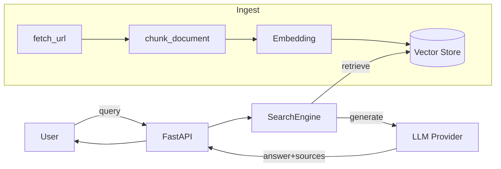
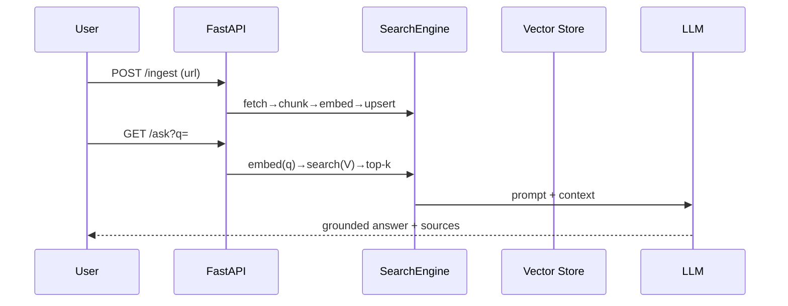

# LLM-search (Sift)

Enterprise, self-hostable **multi-provider RAG search engine** over web content.
Ingest URLs → chunk → embed → store in a vector DB → answer natural-language questions
with a pluggable LLM.

Repo: [github.com/pal404error/sift](https://github.com/pal404error/sift)

## Why
Keyword search fails on semantics. LLM-search returns grounded answers from crawled
content, with cited sources, and runs fully self-hosted for enterprise compliance.

## Architecture





## Providers (pluggable)
- **LLM:** `fake` (dev/test), `openai`, `anthropic`, `ollama`.
- **Embedding:** `fake`, `openai`, `ollama`.
- **Vector store:** `memory` (dev/test) or `qdrant` (production).

## Quickstart (dev, no external deps)
```bash
python -m venv .venv && . .venv/bin/activate
pip install -e . --no-deps
pip install fastapi 'uvicorn[standard]' pydantic pydantic-settings httpx beautifulsoup4 pytest ruff
cp .env.example .env            # defaults use fake providers + memory store
pytest -q                       # 11 tests pass
python -m llm_search.main       # http://localhost:8000/docs
curl localhost:8000/health
```

## Enterprise (Docker)
```bash
docker compose up --build      # app + qdrant
# set real providers in .env: LLM_PROVIDER=openai, EMBEDDING_PROVIDER=openai, VECTOR_STORE=qdrant
```

## API
| Method | Path | Auth | Purpose |
|--------|------|------|---------|
| GET  | `/health` | none | liveness |
| GET  | `/health/providers` | none | provider config (keys redacted) |
| POST | `/ingest?url=` | user | crawl + index a URL |
| POST | `/crawl?url=&max_pages=` | user | BFS crawl a site, index all pages |
| GET  | `/search?q=&top_k=` | user | raw chunk retrieval (reranked) |
| GET  | `/ask?q=&top_k=` | user | RAG answer + sources |

## Phase 2: enterprise hardening
- **Auth & RBAC:** set `REQUIRE_AUTH=true` and `API_KEYS=admin:KEY1,user:KEY2`. Routes are
  gated by bearer token (`admin` > `user`); all access written to `AUDIT_LOG` (JSONL).
  `/health` stays open.
- **Reranking:** retrieve `rerank_multiplier × top_k`, then rerank (`lexical` default,
  `none`, `fake`, or `cross-encoder`). The cross-encoder backend uses a
  `sentence-transformers.CrossEncoder` (optional dep) for higher precision; its scorer is
  injectable for tests. `RERANK_MODEL` selects the model.
- **Evaluation:** `llm_search.eval` exposes `recall_at_k`, `precision_at_k`, `mrr` to measure
  retrieval quality objectively (no training/deps needed).
- **Crawler politeness:** honors `robots.txt` (`RESPECT_ROBOTS=true`) and throttles per host
  by `MIN_CRAWL_INTERVAL` seconds.
- **Site crawling:** `POST /crawl` runs a BFS crawl (`llm_search.crawl`) — link discovery,
  same-domain filter, dedupe, sitemap discovery (`/robots.txt` `Sitemap:` or `/sitemap.xml`),
  and incremental `CrawlState` (ETag/Last-Modified) for re-crawl. `MAX_PAGES_PER_INGEST`
  bounds the blast radius.
- **Provider health:** `/health/providers` reports readiness without leaking secrets.
- **SSO auth:** `AUTH_METHOD=oidc` swaps the API-key verifier for an OIDC/JWT verifier
  (`OidcVerifier`) that fetches JWKS and **verifies the RS256 signature** (PyJWT) before
  trusting `iss`/`aud`/roles — pluggable `TokenVerifier` protocol.
- **Type safety:** `mypy .` is clean (quality gate).
- **Coverage gate:** `pytest --cov=llm_search --cov-fail-under=80`. Real-provider paths
  are covered by env-gated `@pytest.mark.integration` tests (skip without keys).

```bash
mypy .
pytest --cov=llm_search --cov-fail-under=80
```

## Enterprise (Docker)
```bash
docker compose up --build      # app + qdrant
# set real providers: LLM_PROVIDER=openai, EMBEDDING_PROVIDER=openai, VECTOR_STORE=qdrant
# enable auth: REQUIRE_AUTH=true, API_KEYS=admin:<key>,user:<key>
```

## Project conventions
See [`RTK.md`](RTK.md) (Rules/Tech/Knowledge), [`trending-insights.md`](trending-insights.md)
(community patterns), `memory/` (persistent context), and `skills/` (capability packs).
Lint/format via `ruff`; hooks in `.pre-commit-config.yaml`.

## CI/CD & Release
- `.github/workflows/ci.yml` runs quality gates on every PR/push: `ruff`, `mypy`,
  `pytest` with coverage (80% floor), the offline **eval gate** (`make eval` →
  `scripts/run_eval.py --gate-mrr 0.5`), `pip-audit` (deps) + `gitleaks` (secrets), then a
  Docker build. Mirror it locally with `make ci`.
- `.github/workflows/release.yml` builds and pushes the image to GHCR on version tags.
- `pre-commit` enforces ruff + prettier + `gitleaks` + `mypy` locally.
- `make` targets: `install lint type test cov audit ci docker pre-commit`.

## Evaluation
- `scripts/run_eval.py` runs the retrieval eval harness end-to-end (recall@k, precision@k,
  MRR) against a gold corpus (`tests/gold/eval_gold.json` by default). With the default
  **lexical** fake embeddings it validates the whole ingest → search → rerank → eval pipeline
  offline; point `--gold` at a real annotated corpus + set real providers for true relevance.
  Gate CI with `--gate-mrr` (wired as a quality gate in `.github/workflows/ci.yml`).

## Crawling
- `POST /crawl` (or `engine.crawl_site`) does BFS with same-domain filtering, dedupe,
  robots.txt + per-host throttle, and sitemap discovery. It fetches up to
  `CRAWL_CONCURRENCY` pages in parallel and supports **incremental re-crawl**: pass a
  `CrawlState` seeded with prior ETags; unchanged pages return 304 and are skipped
  (not re-ingested). `fetch_url` sends conditional `If-None-Match`/`If-Modified-Since`.

## Command-line
Install the package (`pip install -e .`) to get the `sift` CLI:
```bash
sift serve                       # run the API (uvicorn, http://127.0.0.1:8000)
sift ingest <url>               # index a single page
sift crawl  <url> [--max-pages N]   # crawl + index a site
sift search <query>             # print top retrieved chunks
sift ask    <query>             # print a grounded answer + sources
```
The data subcommands use fake providers automatically when no API keys are set, so the
CLI is usable end-to-end offline.

## Web UI
The API serves a minimal single-page UI at `GET /` (`static/index.html`): a search/ask
box that calls `/search` and `/ask` via `fetch`. No build step required.

## Roadmap
- Offline eval comparing lexical vs cross-encoder rerank; tune `rerank_multiplier`.
- React UI + SSO login.
- OIDC discovery caching/refresh + refresh-token session flow.
