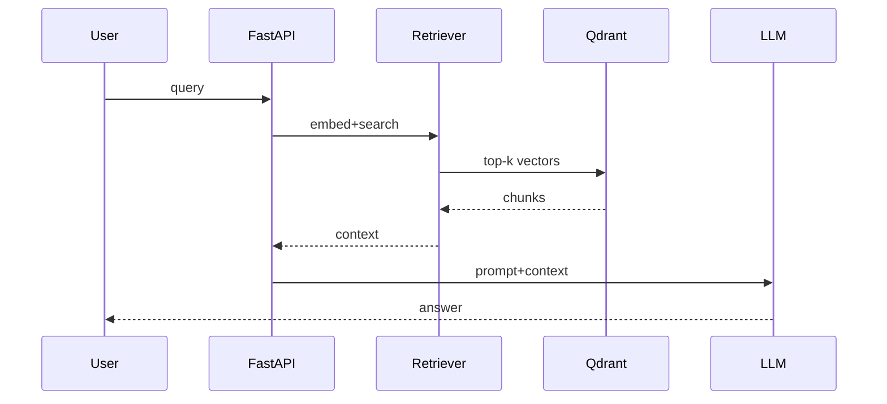

# Diagram Generation

Goal: visual artifacts that reflect reality and live in `docs/`.

## Types & when
- **Architecture** (components + data flow): use at project start and after structural
  changes. Mermaid `flowchart` or `graph`.
- **Sequence** (request/retrieval flow): for RAG pipeline (query → retrieve → rerank →
  generate). Mermaid `sequenceDiagram`.
- **ER / schema** (DB + vector collections): Mermaid `erDiagram` or class diagram for
  Pydantic models.
- **State / decision**: Mermaid `stateDiagram` for ingestion jobs.

## Mermaid starter (RAG flow)

## Discipline
- Generate, then cross-check node names against `memory/knowledge-graph.json`.
- Store diagrams in `docs/` (e.g. `docs/architecture.md`). Keep RTK.md diagrams in sync.
- Prefer Mermaid (GitHub-renderable) unless PlantUML is required by the team.
